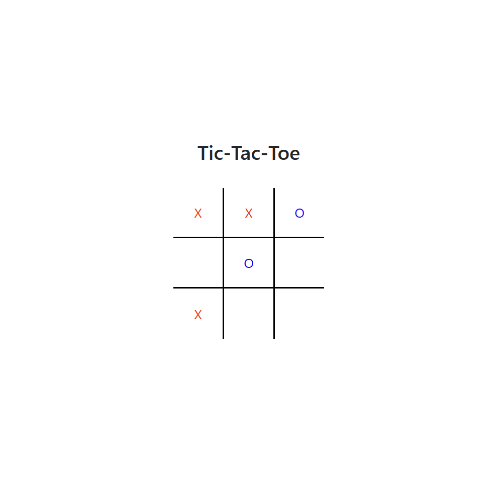

# Tic-Tac-Toe Game 🎮

This is a simple and fun tic-tac-toe game that you can play with your friends on your browser. It is made with JavaScript, CSS, HTML, and Python (Flask). It also has some cool animations for the win conditions, such as vertical, horizontal, and diagonal lines. 🙌

# How to play

To start the game, you need to have the Flask module installed on your computer. You can follow the instructions [here] to install Flask.
Then, you need to run the app.py file in your terminal. This will launch the Flask server and give you a URL to access the game on your browser.
The game is very simple: you just need to click on an empty cell to mark it with either X or O. The first player to mark three cells in a row, column, or diagonal wins the game. 🏆
If the board is full and no one wins, the game is a draw. 😐
After the game ends, you can click on the retry button to play again. 🔁

# Features

* The game has a simple and responsive design that adapts to different screen sizes. 📱
* The game has some nice animations for the win conditions, such as vertical, horizontal, and diagonal lines. They are made with CSS transitions and transformations. 🎨
* The game logic is implemented with JavaScript and Flask. The JavaScript code handles the user interface and the Flask code handles the server-side logic. 🚀
* The game uses javascript Fetch api to communicate with the Flask server without reloading the page. This makes the game faster and smoother. ⚡

# Future improvements

* The game currently only supports player versus player mode. It would be nice to add a player versus computer mode, where the computer can make smart moves using some algorithm. 🤖
* The game currently does not keep track of the score or the history of the moves. It would be nice to add these features to make the game more interactive and competitive. 📊
* The game currently does not have any sound effects or music. It would be nice to add these features to make the game more immersive and enjoyable. 🎵

# Feedback

The game was created by me, <b>mattrams</b>. I'm new to programming and eager to learn more.

Thank you for playing my tic-tac-toe game. I hope you have fun! 😄